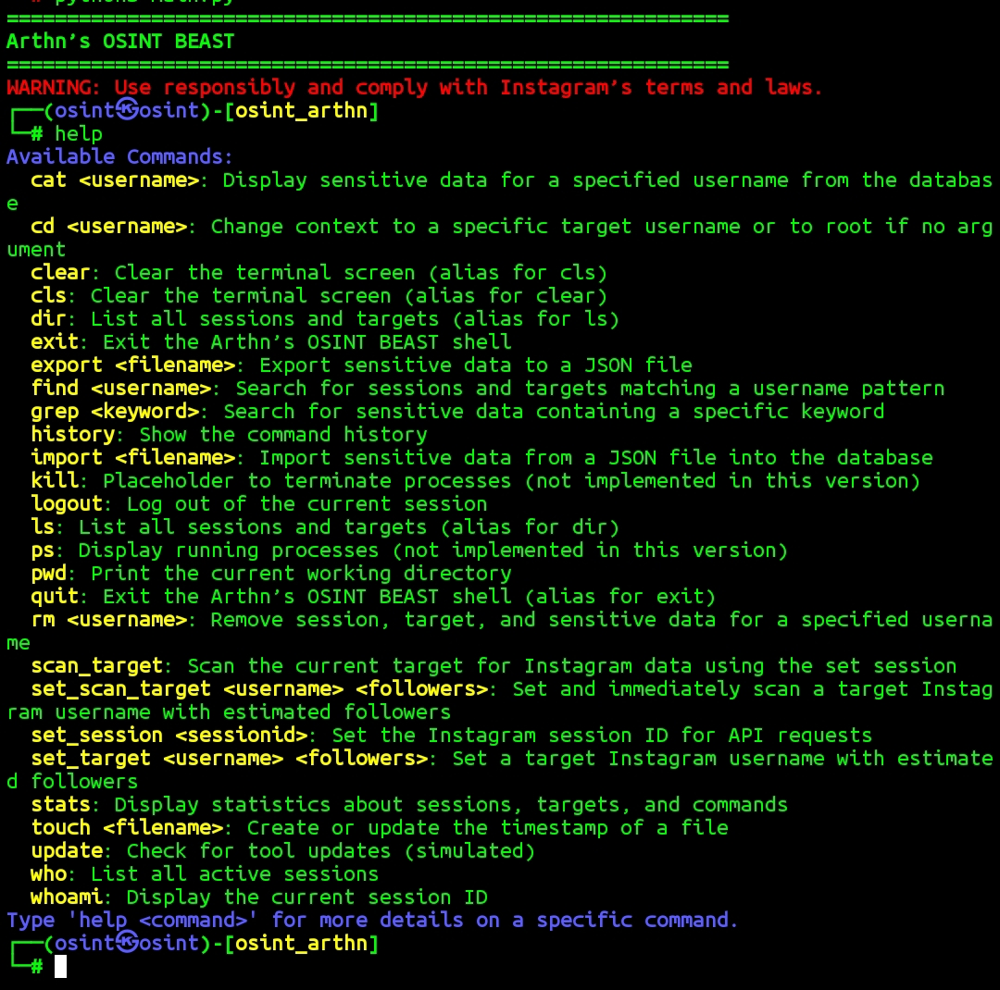

# Arthn’s OSINT BEAST


**Arthn’s OSINT BEAST** هي أداة مفتوحة المصدر لجمع المعلومات مفتوحة المصدر (OSINT) مصممة لتحليل حسابات Instagram. توفر الأداة واجهة أوامر تفاعلية لاستخراج بيانات الملفات الشخصية، العلاقات، المنشورات، القصص، والبيانات الحساسة المحتملة باستخدام تقنيات متقدمة. 
## Tool by Arthn
قناتي التليكرام: [@hack_men](https://t.me/hack_men)
## المميزات
- **جمع بيانات الملف الشخصي**: استخراج معلومات مثل اسم المستخدم، السيرة الذاتية، عدد المتابعين، المنشورات، والروابط الخارجية.
- **تحليل العلاقات**: تحديد العلاقات بين المستخدمين (متابعون، متابعات، تفاعلات).
- **استخراج البيانات الحساسة**: اكتشاف عناوين البريد الإلكتروني، أرقام الهواتف، والبيانات الأخرى من السيرة الذاتية والروابط الخارجية.
- **تحليل المنشورات والقصص**: جمع المنشورات الأخيرة، القصص، والإحصائيات (مثل الإعجابات والتعليقات).
- **واجهة أوامر تفاعلية**: أوامر مستوحاة من Linux مثل `ls`، `cat`، `grep`، و`find` لسهولة الاستخدام.
- **تخزين البيانات**: حفظ البيانات في قاعدة بيانات SQLite (`darkstorm_data.db`) لتحليل لاحق.
- **دعم الجلسات**: إدارة جلسات Instagram باستخدام `sessionid` للوصول إلى البيانات.

## المخاطر والتحذيرات
- **القانونية**: استخدام الأداة لجمع بيانات دون موافقة قد ينتهك شروط Instagram وقوانين حماية البيانات (مثل GDPR أو CCPA).
- **الأخلاقية**: جمع البيانات الحساسة دون إذن يعتبر غير أخلاقي وقد يؤدي إلى انتهاك الخصوصية.
- **الحظر**: قد تؤدي الطلبات المتكررة إلى حظر مؤقت أو دائم من Instagram إذا تم اكتشاف نشاط مشبوه.
- **المسؤولية**: المستخدم مسؤول بالكامل عن أي عواقب ناتجة عن استخدام الأداة. المطور لا يتحمل أي مسؤولية عن سوء الاستخدام.

## المتطلبات
- **Python 3.8+**: تأكد من تثبيت Python على نظامك.
- **المكتبات المطلوبة** (مدرجة في `requirements.txt`):
  - `aiohttp==3.9.5`
  - `requests==2.32.3`
  - `beautifulsoup4==4.12.3`
  - `fake-useragent==1.5.1`
  - `geopy==2.4.1`
  - `lxml==5.3.0`
- **قاعدة بيانات SQLite**: مدمجة مع Python، لا حاجة لتثبيت إضافي.
- **اتصال بالإنترنت**: للوصول إلى Instagram API وتحليل الروابط الخارجية.
## Note
لازم تخلي ملفات الاداة في ملف اسمه instatools لانه تم انشاءة في ملف اكوات انستا. ان لم تضعه سيكون هنالك بعض الاوامر لن تعمل
## التثبيت
1. **استنساخ المستودع**:
   ```bash
   git clone https://github.com/o-x-arthn/Osint-Instagram-.git

```bash
cd Osint-Instagram-
pip install -r requirements.txt --break-system-packages
mkdir instatools
mv *.py instatools
python3 main.py
